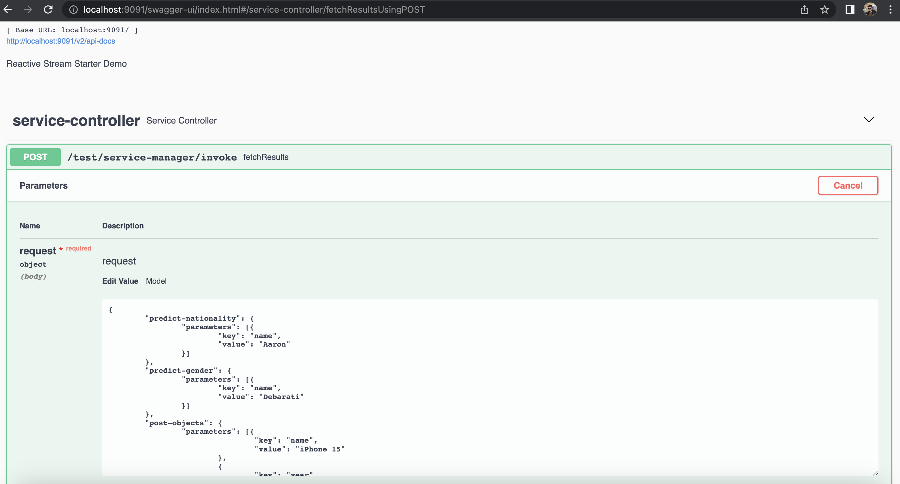

# Read Me First
The following was discovered as part of building this project:

* This Application maintains a registry of all supported/external endpoints and invoke all of them
concurrently and integrate the result in a single response object. If the parameter is not supported in a given endpoint 
then the result will be skipped.
* This Micro-service is running on port 9091 and it exposes following endpoints
Here is the swagger API : (http://localhost:9091/swagger-ui/index.html#/service-controller/fetchResultsUsingPOST) for local testing

    **POST ->  /test/service-manager/invoke**
    
    It invokes all external REST endpoints concurrently using webflux and integrate the result. If the parameter is not
    supported in a given endpoint then the result will be skipped. It reads application registry in resource folder, validate 
    all parameters and construct the external call. If validation passed then make all external invocation simultaneously 
    and construct the response object.
    
    **GET -> /test/service-manager/max-concurrency**
    
    This API reads the registry in application's resource folder fetch the max concurrency for each of the external endpoints
    and render the result to the client
    
    **GET -> /test/service-manager/supported-attributes**
    
    This API provides the supported parameters of each external endpoints reading from the registry.

* This Application internally invokes following opensource External APIs and integrate the result

  1. https://api.nationalize.io?name=nathaniel

    This external GET REST Endpoint predicts nationality based on name
  2. https://api.genderize.io?name=luc

    This external GET REST Endpoint predicts gender based on name
  3. https://api.restful-api.dev/objects

    Body : {
    "name": "Apple MacBook Pro 16",
    "data": {
    "year": 2019,
    "price": 1849.99
    }
    }

    This external POST REST Endpoint insert objects in its platform based on the payload.

* The JVM level is set as '11', review the [JDK Version Range](https://github.com/spring-projects/spring-framework/wiki/Spring-Framework-Versions#jdk-version-range) on the wiki for more details.
# Getting Started

### Reference Documentation
For further reference, please consider the following sections:

* [Official Apache Maven documentation](https://maven.apache.org/guides/index.html)
* [Spring Boot Maven Plugin Reference Guide](https://docs.spring.io/spring-boot/docs/3.1.0/maven-plugin/reference/html/)
* [Create an OCI image](https://docs.spring.io/spring-boot/docs/3.1.0/maven-plugin/reference/html/#build-image)
* [Spring Reactive Web](https://docs.spring.io/spring-boot/docs/3.1.0/reference/htmlsingle/#web.reactive)
* [Spring Boot DevTools](https://docs.spring.io/spring-boot/docs/3.1.0/reference/htmlsingle/#using.devtools)

### Guides
The following guides illustrate how to use some features concretely:

* [Swagger Utl](http://localhost:9091/swagger-ui/index.html)

### Test Case 1 :
_Positive Test Scenario : All parameters are supported by the by predict nationality, predict gender and post objects 
endpoints. Hence in response they are available and none of the values are skipped_

**Request Payload**
{
"predict-nationality": {
"parameters": [{
"key": "name",
"value": "Aaron"
}]
},
"predict-gender": {
"parameters": [{
"key": "name",
"value": "Deb"
}]
},
"post-objects": {
"parameters": [{
"key": "name",
"value": "iPhone 15"
},
{
"key": "year",
"value": "2032"
},
{
"key": "price",
"value": "2000"
}
]
}
}

**Response**
{
"post-objects": "{\"id\":\"ff80818188956aa60188aa9e759c0972\",\"name\":\"iPhone 15\",\"createdAt\":\"2023-06-11T13:21:31.549+00:00\",\"data\":{\"year\":2032,\"price\":2000.0}}",
"predict-nationality": {
"country": [
{
"country_id": "NZ",
"probability": 0.077
},
{
"country_id": "AU",
"probability": 0.07
},
{
"country_id": "US",
"probability": 0.064
},
{
"country_id": "IE",
"probability": 0.059
},
{
"country_id": "CA",
"probability": 0.045
}
],
"name": "Aaron"
},
"predict-gender": {
"count": 79861,
"gender": "female",
"name": "Deb",
"probability": 1
}
}

### Test Case 2:

**Request Payload**
_Negative Test Scenario : Address Parameter is not supported by predict nationality endpoint. Hence, predict nationality 
is skipped in response for this use-case_ 

{
"predict-nationality": {
"parameters": [{
"key": "name",
"value": "Aaron"
},{
"key": "address",
"value": "San Jose"
}]
},
"predict-gender": {
"parameters": [{
"key": "name",
"value": "Deb"
}]
},
"post-objects": {
"parameters": [{
"key": "name",
"value": "iPhone 15"
},
{
"key": "year",
"value": "2032"
},
{
"key": "price",
"value": "2000"
}
]
}
}

**Response**
{
"post-objects": "{\"id\":\"ff80818188956aa60188aaa4f6600973\",\"name\":\"iPhone 15\",\"createdAt\":\"2023-06-11T13:28:37.729+00:00\",\"data\":{\"year\":2032,\"price\":2000.0}}",
"predict-nationality": "",
"predict-gender": {
"count": 79861,
"gender": "female",
"name": "Deb",
"probability": 1
}
}

### Test Case 3:

**Request Payload**
_Negative Test Scenario : price Parameter is missing for the Post Object Endpoint but remaining parameters are supported 
by the post objects endpoint. Hence in post object response result is available.

**Request Payload**
{
"predict-nationality": {
"parameters": [{
"key": "name",
"value": "Aaron"
}]
},
"predict-gender": {
"parameters": [{
"key": "name",
"value": "Deb"
}]
},
"post-objects": {
"parameters": [{
"key": "name",
"value": "iPhone 15"
},
{
"key": "year",
"value": "2032"
}
]
}
}

**Response Payload**
Response body
Download
{
"post-objects": "{\"id\":\"ff80818188956aa60188aaaea5d60974\",\"name\":\"iPhone 15\",\"createdAt\":\"2023-06-11T13:39:12.471+00:00\",\"data\":{\"year\":2032,\"price\":null}}",
"predict-nationality": {
"country": [
{
"country_id": "NZ",
"probability": 0.077
},
{
"country_id": "AU",
"probability": 0.07
},
{
"country_id": "US",
"probability": 0.064
},
{
"country_id": "IE",
"probability": 0.059
},
{
"country_id": "CA",
"probability": 0.045
}
],
"name": "Aaron"
},
"predict-gender": {
"count": 79861,
"gender": "female",
"name": "Deb",
"probability": 1
}
}

# Improvements
* More generic Validation framework can be implemented
* More Specific Exception framework can be included to cover all scenarios.
* More generic Registry parsing mechanism can be implemented.
* More Unit test cases can be written along with integration test suite. 
* Proper commenting guideline can be followed based on organization specific documentation standard